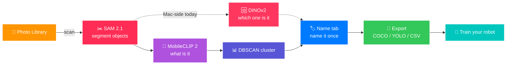

<div align="center">


# 🪄 Vision Builder

### **Roboflow on your phone — for training your own robot.**

*Privately. On-device. With photos you already took.*

<br/>

[](https://developer.apple.com/ios/)
[](https://swift.org)
[](https://developer.apple.com/machine-learning/core-ml/)
[](LICENSE)

[](#-heads-up--nothing-here-is-done)
[](https://ai.meta.com/sam2/)
[](https://huggingface.co/apple/MobileCLIP2-S0)
[](https://docs.ultralytics.com/)
[](https://github.com/facebookresearch/dinov2)

</div>

<br/>

**What it does:** Vision Builder scans your iPhone photo library, cuts every object out with SAM 2.1, groups look-alikes, lets you name each group once, and exports a labeled object-detection dataset (COCO, YOLO or CSV), all on the phone.

**Who it is for:** anyone who wants a labeled dataset of their own things, for example to train a detector for a robot, without uploading photos anywhere. You need an iPhone and Xcode to build it; see [Requirements](#-requirements).

**Status:** work in progress. Some parts are rough and some are not wired up yet. The status table below says which.

**Proof:** [real results on a 4,959-photo camera roll](#-does-it-actually-work-yes--here-are-the-numbers), the Swift source for every stage in this repo, and the [model conversion scripts](scripts/). There are no screenshots, demo video or App Store build yet.

<br/>

> [!WARNING]
> ## 🚧 Heads up — nothing here is "done"
>
> This is an **ongoing project**. Things are half-built. Buttons sometimes lie. Empty states are awkward. The roadmap is longer than the README. We're shipping in the open because the core idea is too good to wait for "done."
>
> **If you find rough edges — that's the point.** Tell us. Or fix it. PRs welcome.

<br/>

---

## 📑 Contents

<table>
<tr>
<td valign="top" width="33%">

**🚀 Start here**
- [✨ The vision](#-the-vision-what-finished-actually-looks-like)
- [🐕 Does it work?](#-does-it-actually-work-yes--here-are-the-numbers)
- [👤 What I built](#-what-i-built)
- [🤔 Why build it](#-why-were-building-it)

</td>
<td valign="top" width="33%">

**🔬 Under the hood**
- [⚙️ How it works](#️-how-it-works-today)
- [📦 What's working](#-whats-actually-working-right-now)
- [🛠️ Tech stack](#️-tech-stack)

</td>
<td valign="top" width="33%">

**🧑‍💻 Get going**
- [🧰 Requirements](#-requirements)
- [🚀 Build it](#-build-it-yourself)
- [🗺️ Roadmap](#️-roadmap)

</td>
</tr>
</table>

<br/>

---

## ✨ The vision (what "finished" actually looks like)

Imagine you just bought a robot. Or you're building one. It needs to recognize **your** stuff — your kitchen, your tools, your kid's toys, the specific objects in your house. Not generic ImageNet "person / car / dog." ***Your*** specific stuff.

The classical pipeline goes something like this:

```diff
- 1. Photograph thousands of objects from every angle
- 2. Upload to Roboflow / V7 / Scale AI
- 3. Pay someone to draw bounding boxes for weeks
- 4. Wait
- 5. Pay more
- 6. Train a model
- 7. Deploy
```

```diff
+ Vision Builder collapses steps 1–5 into:
+ "Open the app. Walk around your house. Done."
```

When this thing is "done" (it never will be — software is forever), here's what it'll do:

| Step | What happens |
| --- | --- |
| 📸 **Capture** | Take photos, or aim at your existing library — your phone already has thousands of pictures of your life |
| ✂️ **Auto-segment** | SAM 2 (or SAM 3, once a CoreML export exists) cuts every object out of every photo, automatically |
| 🧠 **Auto-cluster** | MobileCLIP 2 fingerprints each cut-out and groups them by visual similarity — *"hey, here are 14 photos of what looks like the same coffee mug"* |
| 🏷️ **Label once** | You tap one cluster, type "coffee mug," and **all 14 instances inherit that label**. Big-batch instead of one-photo-at-a-time grinding |
| 🤖 **Export** | Spit out a clean labeled dataset in **COCO JSON, YOLO TXT, or CSV**. Drop it straight into your model training pipeline |
| 🔒 **Stay private** | Nothing leaves the device. No cloud. No upload. No "free tier." Your photos, your data, your dataset |

The end state is a tool you walk around your space with for an afternoon and walk away with a personalized object-detection dataset ready to train a model that actually knows your world.

<br/>

---

## 🐕 Does it actually work? Yes — here are the numbers

Not a benchmark. **4,959 photos off one real iPhone camera roll**, three dogs the owner then identified by name.

<table>
<tr><td width="50%">

### 🆔 DINOv2 — identity
*"which dog is this"*

| Dog | Found | Correct |
|:--|:--|:--|
| 🐶 Shanti | 26 | **26 / 26** |
| 🐕 Theo | 28 | **27 / 28** |
| 🐩 Rupert | 9 | **9 / 9** |

✅ **All three kept apart** at cosine distance 0.75.

</td><td width="50%">

### 🚫 CLIP — semantics
*"is this a dog"*

| Threshold | Result |
|:--|:--|
| Loose (0.45) | 🫠 all 86 dogs → **one blob of 83** |
| Tighter | 💥 everything → **singletons** |
| Anywhere between | ❌ **doesn't exist** |

⚠️ **No working range at any setting.**

</td></tr>
</table>

> [!IMPORTANT]
> This is *why* the early clustering never worked, and it was never a tuning problem.
> CLIP is trained to tell a chair from a lamp — not **your** chair from **mine**.
> Identity needs an identity embedder. 🎯

> [!NOTE]
> These groups were computed on a Mac with the same DINOv2-small model the app uses, then loaded into the app's **Name** tab ([`SeededInboxView.swift`](SeededInboxView.swift)). The on-phone service ([`DINOv2Service.swift`](DINOv2Service.swift)) exists but is not yet wired into the phone's own scan, which still clusters MobileCLIP embeddings with DBSCAN. The Mac-side grouping script is not in this repo.

### 🧱 And here's what it genuinely **cannot** do

| ❌ Limit | 🔍 What we measured |
|:--|:--|
| **Identical mass-produced things** | 28 *different* shipping labels over 886 days → one tight cluster. For inventory, identity isn't in the pixels at all. |
| **Same-breed poultry** | 🦆 Ducks separate from 🐔 chickens cleanly. Individual hens? No — and nothing fixes that. |
| **People, full-body** | Clusters by clothing and event, not person. That half needs a face embedder. |

<br/>

---

## 👤 What I built

Designed and written by **Matt Macosko**. The models are upstream (Meta SAM 2.1 and DINOv2, Apple MobileCLIP 2, Ultralytics YOLO 26 / YOLOE); the app and glue around them is mine:

- **Library scan + clustering:** [`PhotoLibraryIndexer.swift`](PhotoLibraryIndexer.swift), [`ObjectRecognitionEngine.swift`](ObjectRecognitionEngine.swift) (DBSCAN on MobileCLIP embeddings, pending clusters, label-once)
- **SAM 2.1 on CoreML:** [`SAM2CoreMLProcessor.swift`](SAM2CoreMLProcessor.swift), [`SAM2DetectionManager.swift`](SAM2DetectionManager.swift)
- **MobileCLIP 2 embeddings + tokenizer:** [`MobileCLIPService.swift`](MobileCLIPService.swift), [`CLIPTokenizer.swift`](CLIPTokenizer.swift), [`scripts/convert_mobileclip2.py`](scripts/convert_mobileclip2.py)
- **DINOv2 identity + the dog test above:** [`DINOv2Service.swift`](DINOv2Service.swift), [`scripts/convert_dinov2.py`](scripts/convert_dinov2.py)
- **YOLOE 4,585-class detector with YOLO 26 / v8 fallback:** [`YOLOObjectDetector.swift`](YOLOObjectDetector.swift), [`scripts/convert_yoloe.py`](scripts/convert_yoloe.py), [`scripts/convert_yolo26.py`](scripts/convert_yolo26.py)
- **Naming flow:** [`MainTabView.swift`](MainTabView.swift) (Name tab), [`SeededInboxView.swift`](SeededInboxView.swift), [`MorningInboxView.swift`](MorningInboxView.swift)
- **Live camera recognition:** [`LiveRecognitionView.swift`](LiveRecognitionView.swift)
- **Bird's-eye mosaic + concept search:** [`BirdsEyeView.swift`](BirdsEyeView.swift), [`ConceptSearchService.swift`](ConceptSearchService.swift)
- **COCO / YOLO / CSV export:** [`ExportManager.swift`](ExportManager.swift), [`ExportOptionsView.swift`](ExportOptionsView.swift)
- **Model conversion pipeline** (Python 3.12 venv, coremltools patch, fp16 NaN checks): [`scripts/convert_models.sh`](scripts/convert_models.sh)

<br/>

---

## 🤔 Why we're building it

> Because every "AI for robotics" tutorial assumes you have a labeling team.
>
> Most people don't. They have a phone and 15 minutes between things.

> Because Roboflow is great, but uploading 4,000 photos of your living room to a cloud service feels insane.

> Because the iPhone Neural Engine is faster than most cloud GPUs were five years ago, and it's just **sitting in your pocket.**

> Because the future of robots learning to operate in *your* environment shouldn't require a SaaS subscription.

<br/>

---

## ⚙️ How it works (today)


```mermaid
flowchart LR
    A[📸 Photo Library] -->|scan| B[✂️ SAM 2.1<br/>segment objects]
    B --> C[🧠 MobileCLIP 2<br/><i>what</i> is it]
    B -.->|Mac-side today| H[🆔 DINOv2<br/><i>which one</i> is it]
    C --> D[📊 DBSCAN cluster]
    H -.-> E
    D --> E[🏷️ Name tab<br/>name it once]
    E --> F[🤖 Export<br/>COCO / YOLO / CSV]
    F --> G[🦾 Train your robot]

    style A fill:#FF9500,stroke:#fff,color:#fff
    style B fill:#FF2D55,stroke:#fff,color:#fff
    style C fill:#AF52DE,stroke:#fff,color:#fff
    style H fill:#FF375F,stroke:#fff,color:#fff
    style D fill:#5856D6,stroke:#fff,color:#fff
    style E fill:#007AFF,stroke:#fff,color:#fff
    style F fill:#34C759,stroke:#fff,color:#fff
    style G fill:#00C7BE,stroke:#fff,color:#fff
```

<br/>

---

## 📦 What's actually working right now

> [!NOTE]
> Status legend — ✅ working · 🟡 functional but rough · 💤 scaffolded, dormant · ❌ not yet

| Component | Status | Notes |
| :--- | :---: | :--- |
| SAM 2.1 segmentation | ✅ | Solid, runs on Neural Engine |
| MobileCLIP 2 embeddings | ✅ | fp32 (the fp16 tower NaNs — see convert script), center-crop preprocessing |
| YOLOE detection | ✅ | **4,585 classes**, prompt-free open-vocab, decode baked into the CoreML graph (YOLO 26 / v8 fallback) |
| Live recognition tab | ✅ | Point the camera — objects *you've labeled* get named on screen, on-device |
| Bird's-eye dataset mosaic | ✅ | Whole dataset on one zoomable wall (My Things → ⋯) |
| DBSCAN clustering | ✅ | Euclidean on unit vectors, eps measured against real embeddings (not vibes) |
| DINOv2 identity grouping | 🟡 | Measured on a Mac (numbers above); on-phone service written but not wired into the scan yet |
| Photo library scan | ✅ | Working but slow on big libraries |
| Name tab cluster review | 🟡 | Functional, UX still rough |
| Manual labeling flow | 🟡 | Has back/next now, editor is busy |
| Concept search | 🟡 | "Find all my cups" — works, sometimes underwhelming |
| COCO / YOLO / CSV export | ✅ | Ready for any standard pipeline, real zips, share sheet |
| Foundation Models smart-naming | 💤 | Scaffolded — needs A17 Pro+ device |
| SAM 3 text-prompted segmentation | 💤 | Skeleton ready, waiting on an upstream EfficientSAM3 CoreML export |
| iCloud sync | ❌ | On the list |
| Apple Watch quick-label | ❌ | On the list |
| Siri Shortcuts | ❌ | On the list |

<br/>

---

## 🛠️ Tech stack

<table>
<tr>
<td>

**Framework layer**
- 🎨 SwiftUI
- 💾 SwiftData
- 🖼️ CoreImage / Vision

</td>
<td>

**ML layer**
- ✂️ SAM 2.1 (CoreML)
- 🧠 MobileCLIP 2 (Apple)
- 🆔 DINOv2-small (identity)
- 🎯 YOLOE + YOLO 26 (Ultralytics)
- 📊 DBSCAN

</td>
<td>

**Apple Intelligence**
- 🤖 Foundation Models (dormant)
- ⚡ Neural Engine
- 🔒 100% on-device

</td>
</tr>
</table>

<br/>

---

## 🧰 Requirements

> [!IMPORTANT]
> - **iOS 26.0+** (Foundation Models APIs + iOS 26 SwiftUI bits)
> - **iPhone with A14 chip or later** for Neural Engine acceleration
> - **Apple Intelligence device (iPhone 15 Pro+)** *only* for the on-device LLM cluster-naming — everything else runs on older iPhones
> - **Xcode 26+** to build (the project targets the iOS 26 SDK)
> - **A Mac with Apple Silicon + Python 3.10 to 3.12** only if you want to regenerate the bigger models

<br/>

---

## 🚀 Build it yourself

```bash
git clone https://github.com/nicedreamzapp/VisionBuilder.git
cd VisionBuilder

# Optional: generate the upgraded mlpackages (MobileCLIP 2 + YOLO 26)
# Takes ~5 min on Apple Silicon
bash scripts/convert_models.sh all

# Optional extras, not included in "all":
bash scripts/convert_models.sh yoloe     # 4,585-class YOLOE detector
source .venv-models/bin/activate         # created by convert_models.sh
python3 scripts/convert_dinov2.py        # writes dinov2_small_fp16.mlpackage (and an fp32 variant); add it to the target

# Open in Xcode and build to a real device
# (Simulator works but it's slow — no Neural Engine)
open "Vision Builder.xcodeproj"
```

> [!TIP]
> The conversion script auto-creates a Python 3.12 venv (coremltools 8 hates Python 3.14), patches a known coremltools bug for newer numpy, and produces:
> - `mobileclip2_s0_image.mlpackage` (22 MB)
> - `mobileclip2_s0_text.mlpackage` (121 MB)
> - `yolo26n.mlpackage` (4.8 MB)
>
> These are gitignored — too big for GitHub's 100MB file limit, but reproducibly regenerated by the script. Drag them into Xcode and add them to the Vision Builder target.
>
> If you skip conversion, the app still builds and runs on the models already committed here: SAM 2.1, MobileCLIP S0 (v1) and YOLOv8n Open Images. It picks YOLOE, then YOLO 26, then YOLOv8 based on what is bundled.

<br/>

---

## 🎬 First-run flow

```
1. Grant photo library access
2. My Things tab → ⋯ → "Scan Photo Library"
3. Wait — you'll see the object count climb as it scans
4. Name tab → label each cluster (one tap per cluster of N similar objects)
5. My Things tab → ⋯ → "Export All" → COCO/YOLO/CSV
6. Feed the dataset into your training pipeline
7. Train. Deploy. Profit. (lol, jk, you'll iterate forever)
```

> [!NOTE]
> The app also has developer test hooks for a Mac ([`PhotoExportView.swift`](PhotoExportView.swift), [`RemoteCaptureView.swift`](RemoteCaptureView.swift), [`PhotoCleanupView.swift`](PhotoCleanupView.swift)). They only run when a Mac has dropped a request file into the app's Documents folder (copied with `devicectl`). Normal use never sends anything off the phone.

<br/>

---

## 🗺️ Roadmap

> [!NOTE]
> Rough priority order. Subject to change every time we open the app and trip over a bug.

- [ ] Make the **Inbox flow buttery** — it's the heart of the app
- [ ] **SAM 3** integration once an EfficientSAM3 CoreML export ships upstream
- [ ] **Wire DINOv2 into the phone's own scan** so identity grouping no longer needs the Mac
- [ ] **iCloud sync** so you can label across iPhone + iPad
- [ ] **Apple Watch** companion for "label this object" in the wild
- [ ] **Siri Shortcuts** ("scan my latest 100 photos")
- [ ] **On-device YOLO finetuning** — start with COCO, finetune to your dataset right on the phone
- [ ] **Multi-project support** — one dataset for kitchen, another for shop, another for the robot's path
- [ ] **Smarter cluster auto-naming** with Foundation Models when device supports
- [ ] **Collaborative datasets** without cloud — maybe AirDrop the `.mlpackage`?
- [ ] **Robot-specific export presets** — URDF-aware? object pose? still scoping

<br/>

---

## 🙋 Contributing

> Genuinely, please.

| If you... | Do this |
| --- | --- |
| Found a 🐛 bug | Open an issue — even rough notes help |
| Have a 💡 idea | Start a discussion |
| Want to 🔧 code | PRs welcome — file structure is mostly self-explanatory, see `CLAUDE.md` |

I'm learning as I go. If you're a **robotics person** with opinions about training-data formats, an **iOS dev** who's done CoreML in anger, or just someone who's tried to **label 400 photos of their dog** and hated it — you'd add value here.

<br/>

---

## 🙏 Acknowledgments

| Who | What for |
| --- | --- |
| 🦾 [Meta AI](https://ai.meta.com/) | SAM 2.1 and DINOv2 — segmenting anything is wild |
| 🍎 [Apple ML Research](https://machinelearning.apple.com/) | MobileCLIP 2 — vision-language tiny enough for a phone |
| 🚀 [Ultralytics](https://ultralytics.com/) | YOLO 26 + YOLOE, and actually shipping CoreML exports |
| 🤖 [Roboflow](https://roboflow.com/) / Scale AI / V7 | Showing what good labeling tools look like, even if we do it on-device instead |

<br/>

---

## 📜 License

**MIT.** Do what you want with it. If you build something cool, tell us — we want to see the robot.

<br/>

<div align="center">

<sub>Built with ❤️ + 🤖 + a healthy distrust of cloud services.</sub>


</div>
